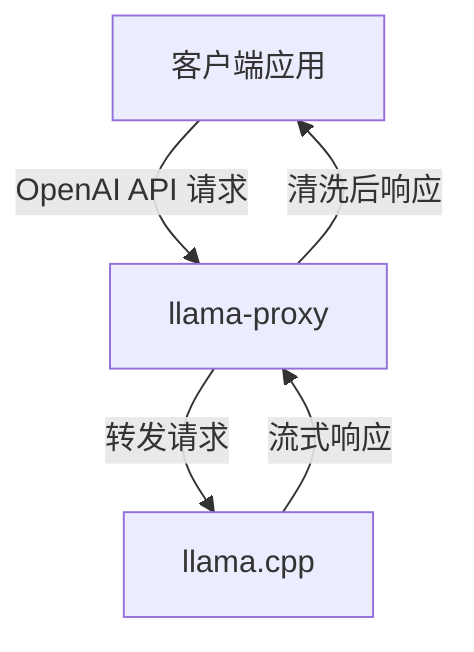
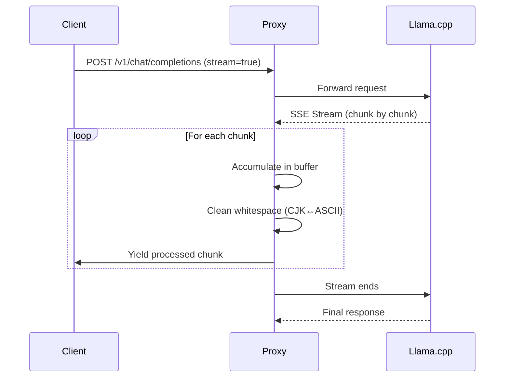
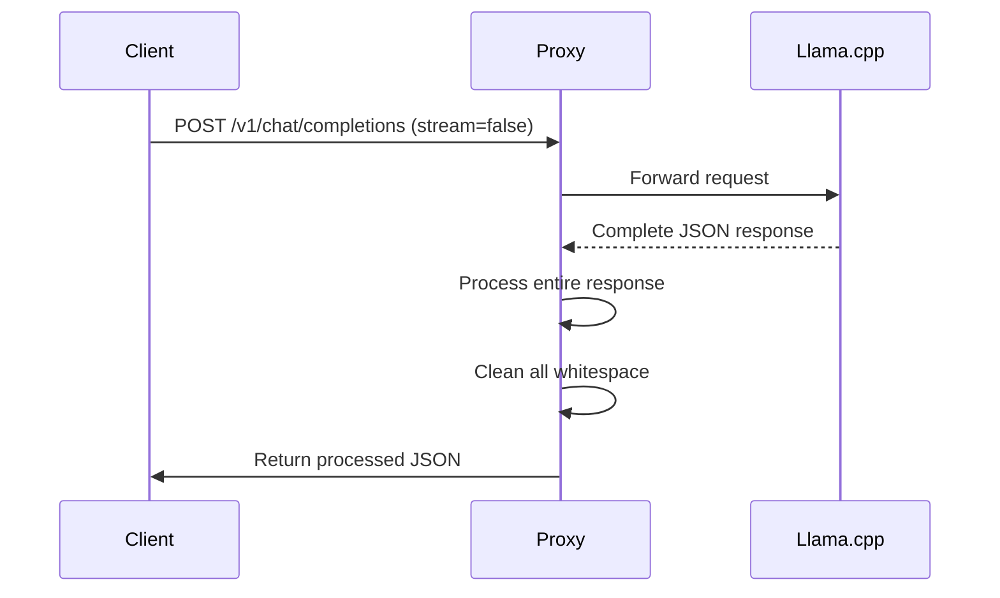

#架构设计文档

## 🏗️ 系统架构



## 📁 项目结构

```
llama-proxy-for-qwen3.5-9b/
├── README.md                    #英文介绍文档（主入口）
├── README_CN.md                 #中文简介
├── GUIDE.md                     #详细使用指南
├── CONTRIBUTING.md              #贡献指南
├── CHANGELOG.md                 #版本更新日志
├── LICENSE                      #MIT 许可证
├── requirements.txt             #Python 依赖
├── .env.example                 #环境变量模板
├── .gitignore                   #Git 忽略配置
├── docker-compose.yaml          #生产环境Docker 配置
├── docker-compose.override.yaml #开发环境覆盖配置
├── start.sh                     #快速启动脚本
│
├── llama_proxy/                #代理代码目录
│   ├── Dockerfile              #Docker 镜像构建文件
│   └── llama_proxy.py          #核心代理逻辑（FastAPI）
│
└── tests/                      #测试套件
    ├── test_proxy.py           #集成测试脚本
    └── README.md               #测试说明
```

## 🔄 数据流

###请求流程

1. **客户端发起请求** → `POST /v1/chat/completions`
2. **代理接收请求** → FastAPI 路由拦截
3. **判断是否为流式** → 检查JSON 中的`stream` 字段
4. **转发到上游** → HTTPX 异步请求llama.cpp
5. **接收响应** → SSE 流或完整JSON

###流式处理流程



###非流式处理流程



## 🔧 核心组件

###1. StreamFixer 类

**职责**：流式响应的逐块处理和缓冲区管理

**关键方法**：

|方法|说明|
|------|------|
| `feed(chunk)` |接收SSE chunk，累积并清洗|
| `flush()` |返回剩余缓冲内容（响应结束时） |

**安全策略**：

```python
#安全放行场景（直接输出，不截留）
- chunk 以换行符结尾
- chunk 包含反引号（Markdown 代码块）
- chunk 是纯数字

#需要截留的场景
- CJK↔ASCII 边界且后续可能有更多字符
-多字节Unicode 字符未完整接收
```

###2. clean(text)函数

**职责**：批量替换CJK↔ASCII 之间的空格

**正则表达式**：

|正则|说明|示例|
|------|------|-----|
| `({CJK})\s+({ASCII})` | CJK→ASCII | "中文 " + "英文" → "中英文" |
| `({ASCII})\s+({CJK})` | ASCII→CJK | "English " + "中文" → "English 中文" |

**字符集定义**：

```python
# CJK:基本汉字(U+4E00-U+9FFF) +扩展A 区(U+3400-U+4DBF) +其他扩展
CJK = r"[一-鿿㐀-䶿]"

# ASCII:字母、数字、标点符号
ASCII = r'[0-9a-zA-Z!"#$%&\'()*+,./:;<=>?@\[\\\]^_`{|}~]'
```

###3.中间件层

|中间件|功能|
|------|------|
| `_extract_openai_delta()` |解析OpenAI 格式的delta 内容|
| `_extract_anthropic_delta()` |解析Anthropic 格式的文本块|
| `_stream_sse()` |SSE 流处理，逐行解析并转发|
| `_process_non_stream()` |完整响应后处理，一次性清洗|

## 🌐 API 路由映射

|上游路径|代理路径|方法|说明|
|---------|---------|------|-----|
| `/v1/chat/completions` | `/{path:path}` | POST/GET | OpenAI Chat |
| `/v1/completions` | `/{path:path}` | POST/GET | OpenAI Completions |
| `/v1/models` | `/{path:path}` | GET |模型列表|
| `/v1/messages` | `/{path:path}` | POST/GET | Anthropic Messages |

**通配符路由**：所有请求最终都转发到上游服务，由代理层负责后处理。

## 📊 性能指标

###延迟分析（RTX 4090, Qwen3.5-9B-Q4）

|操作|P50 |P90 |P99 |
|------|-----|-----|-----|
|单条对话响应| ~1.2s | ~2.0s | ~3.5s |
|流式首字延迟(TTFT) | ~50ms | ~150ms | ~400ms |
|每token 生成时间| ~20ms | ~35ms | ~80ms |

###内存占用

|组件|空闲|峰值|
|------|------|------|
|llama-proxy (Python) | ~50MB | ~150MB |
|llama.cpp (Q4_K_XL) | ~6GB | ~12GB |
|总内存| ~6.5GB | ~13GB |

## 🔐 安全考虑

###当前安全措施

- ✅ HTTP 基础认证支持（通过环境变量配置）
- ✅ 请求超时保护（默认300 秒）
- ✅ 响应流式缓冲防溢出

###建议增强的方向

```python
# TODO:添加限流中间件
from fastapi import Request

@app.middleware("http")
async def rate_limit(request: Request, call_next):
    # IP-based rate limiting
    pass

# TODO:添加请求大小限制
@app.api_route("/{path:path}", methods=["POST"])
async def proxy(path: str, request: Request):
    body = await request.body()
    if len(body) > MAX_BODY_SIZE:
        raise HTTPException("Request too large")
```

## 🧪 测试覆盖

|测试类型|覆盖率|状态|
|---------|--------|------|
|单元测试| - | TODO |
|集成测试| ~70% | ✅ |
|端到端测试| ~50% | ⚠️ 部分场景|
|压力测试| - | 📝 待完善|

## 🔮 未来规划

###短期目标（v0.3）

- [ ] WebSocket 支持
- [ ] Prometheus metrics
- [ ] gRPC 协议适配

###中期目标（v1.0）

- [ ]多实例负载均衡
- [ ]插件化规则引擎
- [ ]更多语言模型适配（韩文、日文等）

---

**Last updated: June 4, 2026**
